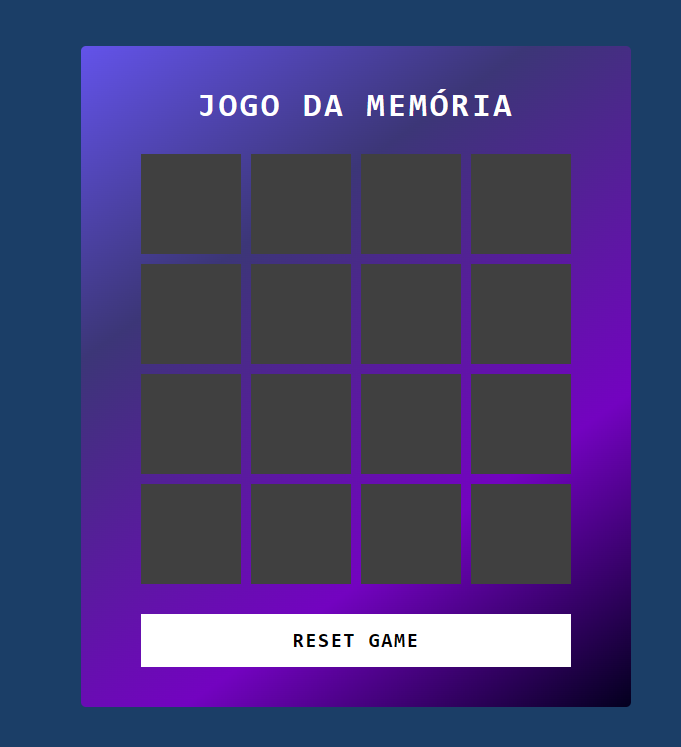

# 📂 Projeto Jogo da Memória

## 📃 Projeto desenvolvido durante Bootcamp Potência Tech iFood - Desenvolvimento de Jogos na plataforma da DIO

 

## 🚀 Tecnologias

- HTML
- CSS
- JavaScript
- Git e Github

 

## 💻 Projeto
> Frontend da aplicação 📸

  

[Acessar o projeto](https://wsawebmaster.github.io/js-jogo-da-memoria/)

 

## 🎯 Como Jogar

1. Clique sobre uma das cartas e observe o emoji
2. Clique sobre outra carta na busca do mesmo emoji
3. Dando Match Maravilha, caso contrário continue procurando  😉
4. Clique no botão RESET GAME para iniciar uma nova partida

---
---
## 📧 Contato
[LinkedIn](https://www.linkedin.com/in/wsawebmaster/)

wsawebmaster@yahoo.com.br
